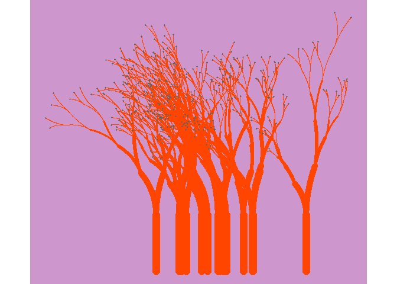

Random_Art_Function
================
Eline de Vries
2024-01-26

``` r
knitr::opts_chunk$set(echo = TRUE)

# devtools::install_github("djnavarro/flametree")
library(flametree)

#Adapted from flametree package. Adjustments allow for generation with seed input only

make_art <- function(Seed){
  set.seed(Seed)
  art_colours <- sample(colors(distinct = FALSE), size = 3, replace = FALSE)
  ran_time <- sample(c(1:10), size = 1)
  ran_trees <- sample(c(1:25), size = 1)
  data_structure <- flametree_grow(seed = Seed, time = ran_time, trees = ran_trees)
  back_colours <- sample(colors(distinct = FALSE), size = 1)
  plants <- sample(c("plain","voronoi", "wisp", "nativeflora", "minimal","themegray"), size = 1)
  data_structure %>% flametree_plot(background = back_colours, palette = art_colours, style = plants)
}

make_art(20242025) # Example with random seed
```

<!-- -->
